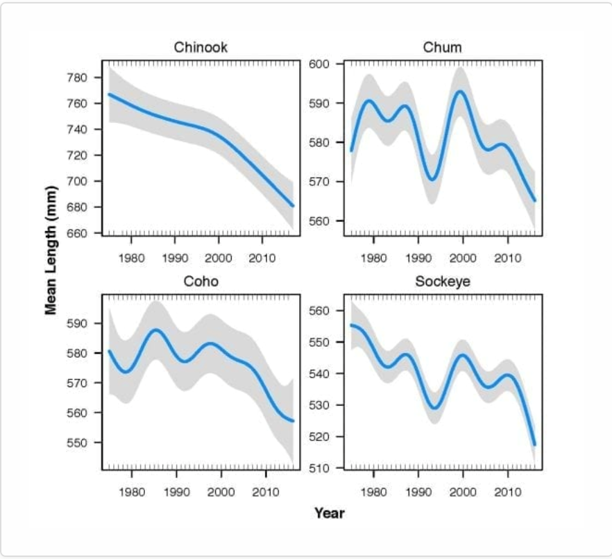
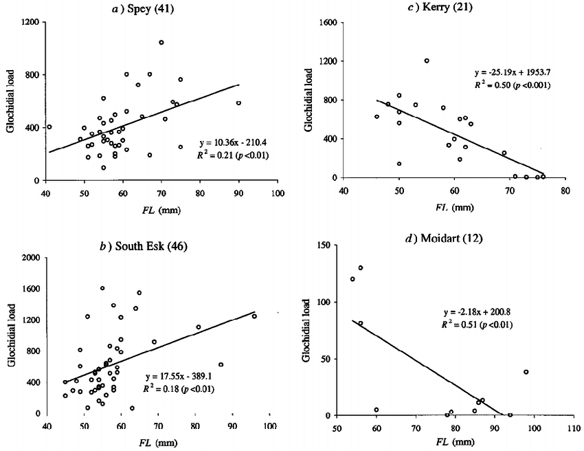

### Project: Spicy Salmon

# An Analysis of the Declining Size and Age of Salmon

#### Team Members:
Aarushi Bhatnagar  
Rebecca Klein  
Nitidh Lamsam\
Nahom Abi

###### Affiliation
Info-201: Technical Foundations of Informatics  
The Information School  
University of Washington  
Autumn 2019

### Problem situation
> Salmon are decreasing in size and living shorter lives in the Pacific Northwest, most prevalently in Alaska. Their smaller size also means laying fewer eggs, decreasing the size of the whole population. The stakeholders are the Alaskan residents for whom salmon is a large part of their diet, the fishermen, who lose profits from the decrease in total pounds of fish they catch, and the entire world who’s ecosystem is being affected by the change. There has to be a balance between catching enough salmon to eat or make a living, and leaving enough salmon to stop the decrease of the population. There is also a tension between those who put more emphasis on the world and the salmon’s health and those who have more of a monetary interest in selling the fish.
###### What is the problem?
> The primary problem this dataset addresses is the decreasing size of salmon (Chinook (also known as king), coho (silver), chum (dog), and sockeye (red)) in Alaska. The decreasing size of salmon is impacting subsistence users, commercial fishermen, and ecosystem in a negative way. This reducing size means less food for people, less weight per salmon for commercial fishermen, and less nutrients in the ecosystem.The two main reasons for the reducing size of salmon may be that this may be their inability to acquire food at sea or their return at younger ages from the sea.
###### Why does it matter?
> The decreasing size of salmon is primarily impacting Alaska’s people, economy, and ecosystems. The subsistence users are catching the same number of salmon, but smaller in size, and are thus facing a reduction of nutrients, protein, and calories, which significantly impact their daily health. The commercial fishermen are losing profit as fish with less meat cannot be processed into high value products. Additionally, key aspects of Alaska’s ecosystems that rely on salmon nutrients are facing issues. The animals that rely on a salmon diet are getting less food and nutrients and most significantly smaller salmon are laying fewer eggs – thus reducing the overall salmon population.
###### How will it be addressed?
> Through the analysis of the salmon datasets, we plan to pinpoint the primary reason for the reducing size of the salmon. We aim to show a correlation between reducing salmon size, reducing available food for salmon, and reducing maturity age for salmon. Additionally, we want to present potential ways through which the reduction in size can be minimalized.
###### Research Questions
* Has there been a correlation between increase in fishing and decrease in salmon size?
* Has there been a correlation between the amount of food available for salmon and decrease in size?

###### Possible Data Sets
> The data sets we are looking to use in this project are as follows: the proof of reduction in size; the reduction of salmon’s food availability at sea; and the reduction in age of salmon at maturity.
>
> The first dataset we found is the [Metadata: Sockeye salmon age measurements from scale data, Alaska from 2011-2017](https://knb.ecoinformatics.org/view/doi:10.5063/F1ZW1J77). It shows the decreasing in size of salmon where we mainly focus at the year, age, sex, and location of the data. There are 10,513 samples available (rows) in the data and 58 columns of information.  
>
> The second data set we retrieved is the [Chinook salmon age, sex, and length data from major rivers in Southeast Alaska, from 1988-2017](https://knb.ecoinformatics.org/view/doi:10.5063/F11R6NSS). The data has 65,534 samples available (rows) and 16 columns of information.

###### Information Visualizations

> We believe that a line graph would be the best strategy to present our information since it clearly shows the exact values and trend of the data. We can calculate the change in the length of the salmon and the rate of change (gradient of the slope). We would use the line graph when we have a continuous category on the X axis, such as, time (year).

> A scatter plot is another great tool to display the relationship between two factors of the data. We can use a trend line to determine positive, negative, or no correlation. For example, the length of the salmon varies across the same age; therefore, the scatter plot can be used to represent all the values from the data and see the overall trend.
### Team work commitments
##### **Meeting Time**
> Fridays at 2:30pm in Mary Gates Hall Commons
##### **Roles**
###### Aarushi Bhatnagar: Primary writer
> Goal: My goal is to gain a better understanding of the tools in R and how they are used to analyze data
###### Rebecca Klein: Primary formatter
> Goal: learn how to effectively present information using R and GitHub Wiki
###### Nitidh Lamsam (Pum): Primary researcher
> Goal: gain a better understanding of data science by using R and how to effectively work as a team.
##### **Communication**
> Text group and skype call
##### **Feedback**
> All of us review each other’s work and leave comments as suggestions. All communication challenges are discussed during our in-person meetings on Fridays.
### Project questions/comments
> We understand that it is very difficult to imply causation, but can we still discuss correlation and its potential reasons?
### References
[State of Alaska's Salmon and People](https://knb.ecoinformatics.org/portals/SASAP/Topics#thedecliningsizeandageofsalmon)  
[PBS - Shrinking Salmon](https://www.pbs.org/wgbh/evolution/library/10/3/l_103_02.html)  
[Demographic changes in Chinook salmon across the Northeast Pacific Ocean](https://onlinelibrary.wiley.com/doi/full/10.1111/faf.12272)
